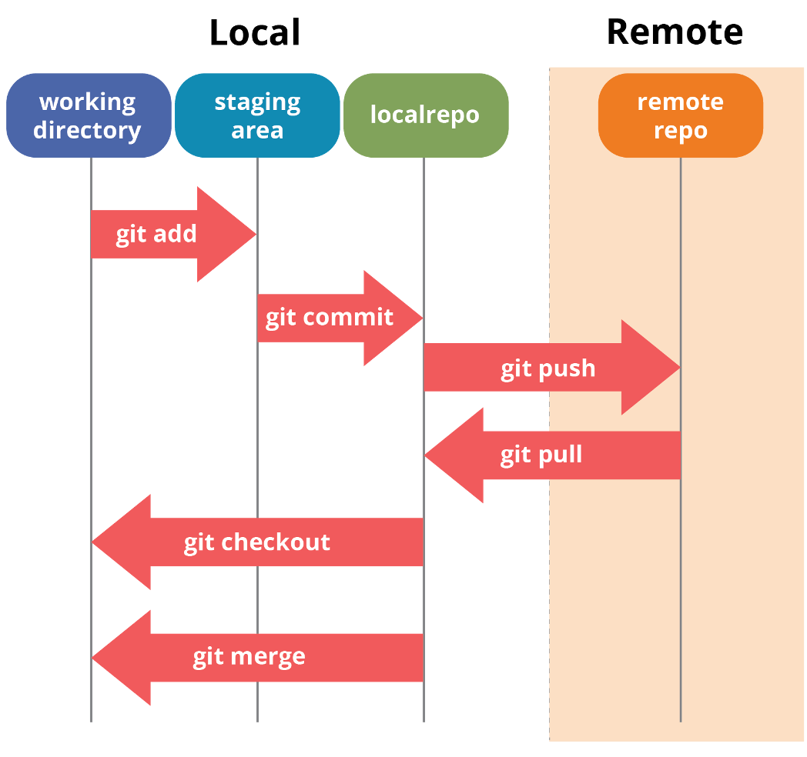

# trn-azure-pipeline

Példa repository Azure Pipeline alapú megoldásokhoz

## Git alapok


### Telepítés

https://git-scm.com

### Első beállítás

Futtasd le az adott parancsokat az adataiddal

```bash
git config --global user.name "Neved"
git config --global user.email "az@email.címed"
```


## GitHub Desktop

Telepítés: https://desktop.github.com
(Windows, Mac, Linux)


### Helyi repo létrehozása adott mappában

```bash
git init
```

### Távoli repository másolása helyi mapppába

```bash
git clone https://github.com/cloudsteak/trn-azure-pipeline.git
```

### Módosított fájlok hozzáadása helyi repohoz

```bash
git add .
```

### Módosított fájlok véglegesítése helyi repoban

```bash
git commit -m "valami szöveg, ami leírja a módosítást"
```

### Módosított fájlok feltöltése a távoli repository-ba

```bash
git push origin main
```


## Git kommunikácó



## Azure Pipeline létrehozás és kapcsolat GitHub-al

1. Personal Acces Token létrehozás: https://github.com/settings/tokens
2. "Generate new token (classic)"
    - Note: A token neve. Adj valami értelmezhető nevet. Pl.: AZPIPELINEPAT
    - Expiration: Token lejárati ideje. Tesztelés esetén választhatod a "No expiration". Éles rendszer esetén adj lejárati időt!!!
    - Az alábbi részeket válaszd ki a jelölönégyzeteknél
        - "repo": mindegyiket alatta
        - "admin:repo_hook": mindegyiket alatta
        - "user": mindegyiket alatta
3. "Generate token" gombra kattintéssal a token létrejön.
4. A tokent másold biztonságos helyre! Nem visszafejthető.
5. Menj át az Azure DevOps-ba, a saját organization és project alapján. Pl.: https://cloudsteak.visualstudio.com/MentorKlub/_settings/adminservices (Project Settings > Service connections)
6. "Create service connection"
7. "New Azure service connection" résznél válaszd a GitHub-ot
8. "New GitHub service connection" résznél az alábbi módon töltsd ki
    - "Personal Access Token Authentication"
    - "Personal access token" mezőbe illeszd be a GitHub-on generált token értékét
    - "Service connection name" mezőbe adj egy nevet. Pl.: GITADOCONN
    - Jelöld be a "Grant access permission to all pipelines" jelölő négyzetet
    - Kattints a "Verify and Save" gombra
9. Menj a Pipeline részbe. Pl.: https://cloudsteak.visualstudio.com/MentorKlub/_build
10. "Create Pipeline"
11. GitHub (Yaml)
12. Select lapon görgess a lapaljára és kattints az utolsó sorban a linkre: "You may also select a specific connection."
13. Választd a "GITADOCONN"-t
14. Keresd meg a GitHub repo-k között, amivel kapcsolódni szeretnél.
15. Létező YAML esetén a Run gomb melletti nyilra kattins és válaszd a "Save" lehetőséget.
16. Várd meg míg a pipeline létrejön. Ezzel a kapcsolt kész.
17. Ha GitHub-on módosítasz a kódon, akkor a pipeline elindul és a benne lévő kód lefut.


# Elérhető képek (Virtuális gépek ée komponensek)

https://github.com/actions/runner-images


# Pipeline példa

Hozz létre egy `demo` nevű branch-et és válts át rá

## Azure Pipeline

1. Nyisd meg a `azure-pipelines.yml` fájlt
2. Másold bele az alábbi tartalmat:
```yaml
# Starter pipeline
# Start with a minimal pipeline that you can customize to build and deploy your code.
# Add steps that build, run tests, deploy, and more:
# https://aka.ms/yaml

trigger:
- main
- demo

pool:
  vmImage: ubuntu-latest

steps:
- script: echo Hello, world!
  displayName: 'Egy soros parancsok'

- script: |
    echo "##[section]Egyéb parancs, megjegyzéssel"
    echo "##[command]Mappa tartalmának listázása"
    ls -l
    echo "##[command]Elérési út"
    pwd
    echo "##[debug]Ez egy olyan üzenet, amit akkor használunk, ha valami hibajavítási üzenetet szeretnénk kiiratni"
    env

  displayName: 'Több soros parancsok'
```
3. `Commit` majd `Push`
4. [Azure DevOps-ban](https://cloudsteak.visualstudio.com/MentorKlub/_build) nézd meg mi történik

## GitHub Acton

1. Workflows mappa létrehozás
   ```bash
   mkdir -p .github/workflows
   ```
2. Hozz létre egy `alap.yaml` nevű fájlt ebben a mappában.
3. Másold bele az `alap.yaml` fájlba az alábbit:
```yaml
# This is a basic workflow to help you get started with Actions

name: CI

# Controls when the workflow will run
on:
  # Triggers the workflow on push or pull request events but only for the "main" branch
  push:
    branches: [ "demo" ]
  pull_request:
    branches: [ "main" ]

  # Allows you to run this workflow manually from the Actions tab
  workflow_dispatch:

# A workflow run is made up of one or more jobs that can run sequentially or in parallel
jobs:
  # This workflow contains a single job called "build"
  build:
    # The type of runner that the job will run on
    runs-on: ubuntu-latest

    # Steps represent a sequence of tasks that will be executed as part of the job
    steps:
      # Checks-out your repository under $GITHUB_WORKSPACE, so your job can access it
      - uses: actions/checkout@v3

      # Runs a single command using the runners shell
      - name: Egy soros parancsok
        run: echo Hello, world!

      # Runs a set of commands using the runners shell
      - name: Több soros parancsok
        run: |
          echo "##[section]Egyéb parancs, megjegyzéssel"
          echo "##[command]Mappa tartalmának listázása"
          ls -l
          echo "##[command]Elérési út"
          pwd
          echo "##[debug]Ez egy olyan üzenet, amit akkor használunk, ha valami hibajavítási üzenetet szeretnénk kiiratni"
          env
```
4. `Commit` majd `Push`
5. [Actions](https://github.com/cloudsteak/trn-azure-pipeline/actions) link alatt nézd meg mi történik.
